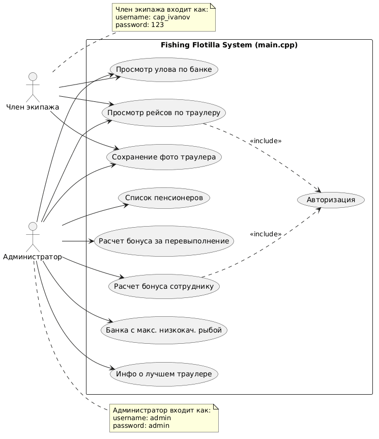
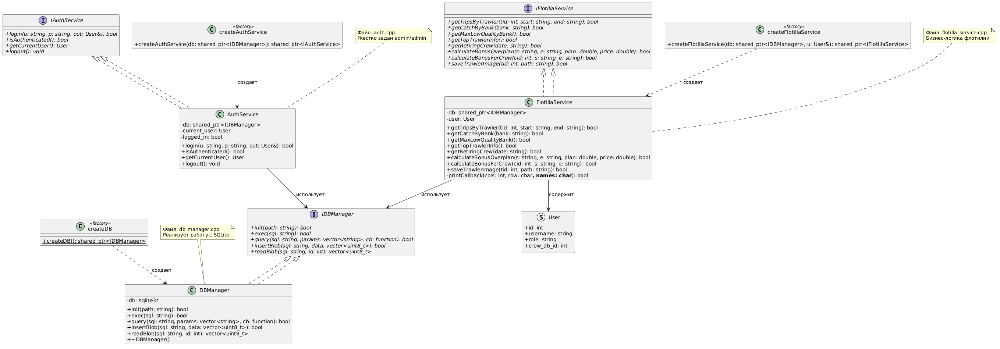
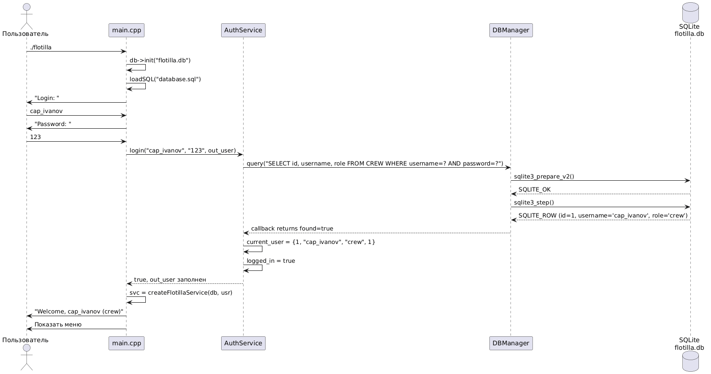
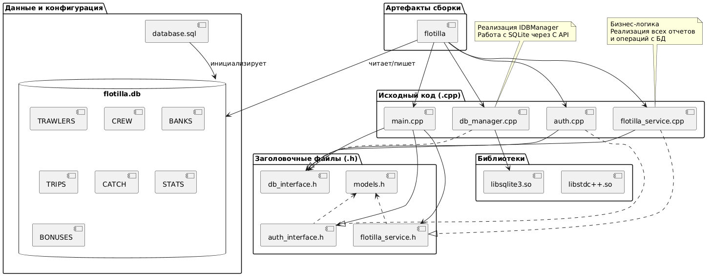
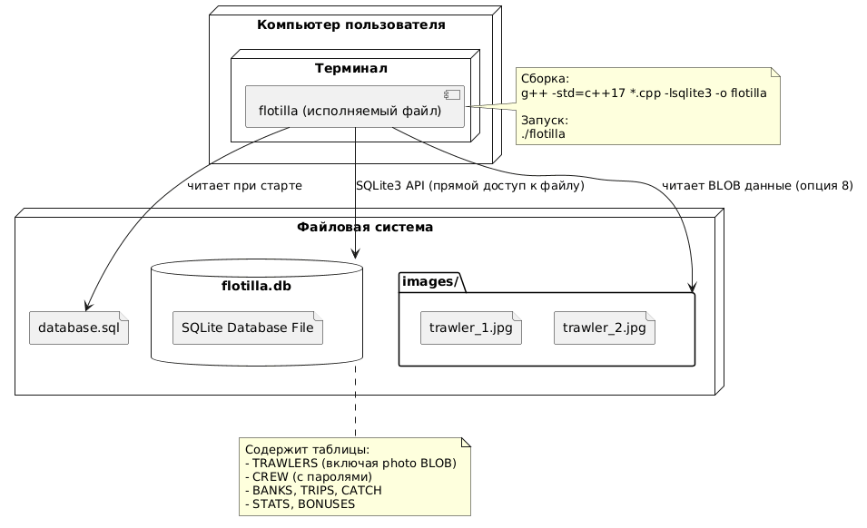

# ЗАДАНИЕ 3. ПРОЕКТИРОВАНИЕ ПРИЛОЖЕНИЯ «РЫБОЛОВНАЯ ФЛОТИЛИЯ»

## 1. Описание проектного решения

В рамках данного этапа выполнено проектирование архитектуры консольного приложения на языке C/C++ для автоматизации работы рыболовной флотилии (Вариант 2). Проектирование выполнено с использованием языка моделирования UML. Основное внимание уделено разделению логики на уровни доступа (Администратор и Член экипажа), а также модульности компонентов системы для обеспечения сборки и тестирования.

## 2. Диаграмма вариантов использования (Use Case Diagram)

Диаграмма иллюстрирует функциональные требования к системе с точки зрения двух акторов: **Администратор** (Управление флотилией) и **Член экипажа**.
*   **Акторы**:
    *   `Администратор`: Имеет полный доступ к статистике, данным о траулерах, экипажах и начислению бонусов.
    *   `Член экипажа`: Имеет ограниченный доступ, может просматривать информацию о своем траулере и рейсах.
*   **Отношения**: Все варианты использования требуют обязательной авторизации (`include`).

### Пример текстового сценария: «Расчет бонуса за перевыполнение плана»
1.  Администратор успешно проходит аутентификацию.
2.  Система отображает главное меню.
3.  Администратор выбирает пункт «Расчет бонуса за перевыполнение плана».
4.  Система запрашивает период (начальная и конечная дата), плановое задание по вылову и среднюю стоимость килограмма рыбы.
5.  Администратор вводит запрошенные данные.
6.  Система обращается к таблицам `TRIPS` и `CATCH` для расчета общего улова за период.
7.  Система вычисляет сумму премии и сохраняет результат в таблицу `BONUSES`.
8.  Система выводит сообщение об успешном расчете.

## 3. Диаграмма классов (Class Diagram)

Диаграмма описывает статическую структуру приложения, реализованного на C++. Показаны основные интерфейсы (`IAuthService`, `IDBManager`) и их реализации. 
*   **`IDBManager`**: Абстрактный интерфейс для работы с БД, обеспечивающий независимость бизнес-логики от конкретной СУБД (SQLite).
*   **`AuthService`**: Управляет сессией текущего пользователя (аутентификация и авторизация).
*   **`FlotillaService`**: Содержит основную бизнес-логику варианта (отчеты, расчет премий, операции CRUD). Методы сервиса соответствуют пунктам задания из варианта №2.

## 4. Диаграмма последовательности (Sequence Diagram)

Диаграмма детализирует процесс **входа в систему (Login)** — ключевой сценарий, влияющий на последующее отображение меню в зависимости от роли пользователя.

*   **Участники**: Пользователь, исполняемый файл (`main`), объект `AuthService`, объект `DBManager` и База данных SQLite.
*   **Поток событий**:
    1.  Пользователь запускает приложение, инициализируется БД.
    2.  Пользователь вводит логин/пароль.
    3.  `AuthService` формирует `SELECT` запрос к таблице `CREW`.
    4.  При успешной проверке создается экземпляр сервиса `FlotillaService` с правами текущего пользователя.

## 5. Диаграмма компонентов (Component Diagram)

Диаграмма показывает физическую структуру файлов проекта и их зависимости. Проект организован согласно требованиям сборки для GitHub Actions.

*   **Исходный код**: Логически разделен на модули (`main.cpp`, `auth.cpp`, `flotilla_service.cpp`).
*   **Данные и Конфигурация**:
    *   `database.sql`: Скрипт первичной инициализации таблиц БД.
    *   `flotilla.db`: Файл базы данных SQLite.
*   **Артефакты**: Исполняемый файл `flotilla` и внешняя библиотека `libsqlite3`.

## 6. Диаграмма развертывания (Deployment Diagram)

Диаграмма описывает топологию развертывания консольного приложения на целевой машине (рабочей станции пользователя или сервере сборки CI).

*   **Узел**: Компьютер пользователя.
*   **Среда исполнения**: Терминал / Консоль.
*   **Артефакты**: Исполняемый файл `flotilla`.
*   **Хранилище**: Файловая система, содержащая файл БД `flotilla.db` и директорию `images/` для хранения BLOB-объектов (фотографий траулеров).

